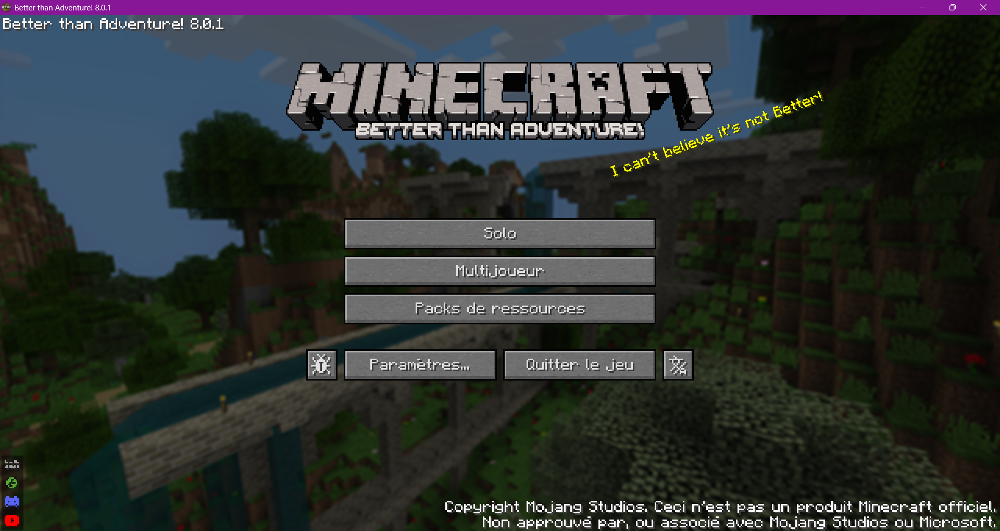
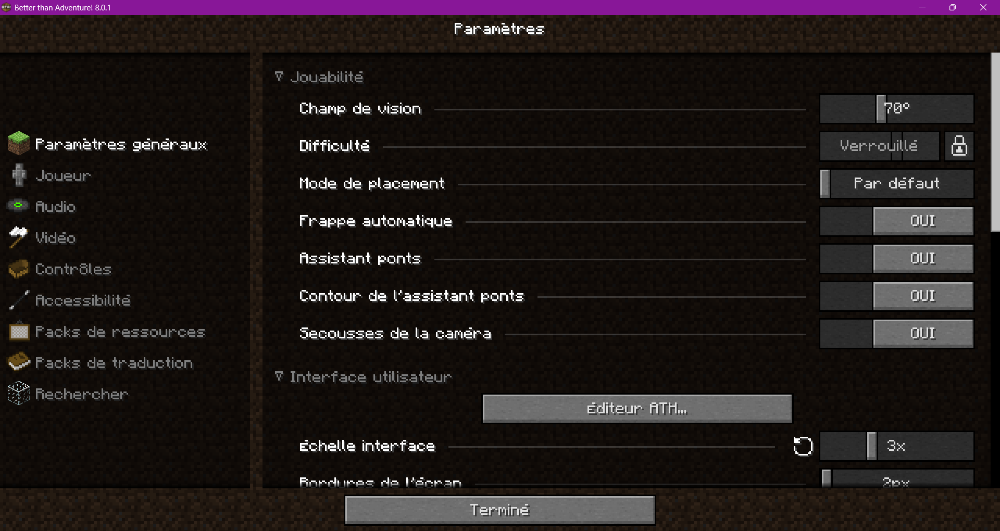
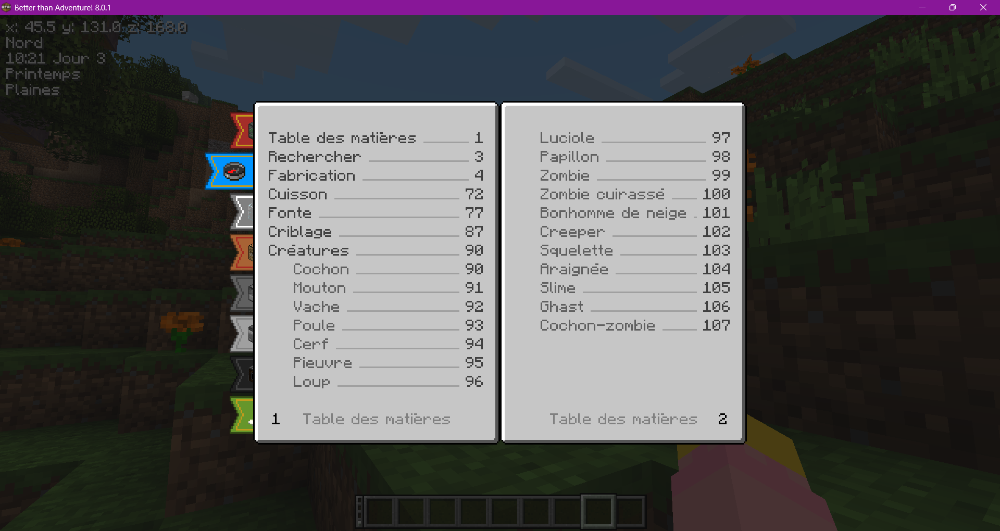

# Better than Adventure! en français (France)
Traduction en français (France) de « [Better than Adventure!](https://www.betterthanadventure.net/) »

> [!IMPORTANT]
> Je me suis rendu compte après avoir publié ce projet qu'il existait déjà un projet de [traduction de BTA! en français](https://github.com/Pygargue00fr/Pygargue00fr-Better-Than-Adventure---Localisation-Francaise), piloté par Pygargue00fr et publié originellement sur le Discord communautaire de BTA!, que je n'avais pas encore rejoint à ce moment-là.
>
> Comme deux projets distincts ne profitent pas à grand monde, j'ai décidé d'archiver ce projet, préférant contribuer à celui de Pygargue00fr. Par conséquent, ce dépôt ne bénéficiera d'aucune mise à jour !

## Installation
- Téléchargez le [pack de traduction](https://github.com/Voxybuns/BTA-fr-FR/releases) pour la version de Better than Adventure! désirée.
- Lancez Better than Adventure! et ouvrez le menu des options.
- Dans l'onglet « Language Packs », cliquez sur le bouton « Open Folder » pour ouvrir le dossier d'installation des traductions.
- Copiez-y le pack de traduction, et activez-le depuis le jeu.
- Better than Adventure! est désormais traduit en français !

## Licence

Les traductions originales de ce pack sont disponibles sous [licence MIT](https://github.com/Voxybuns/BTA-fr-FR/blob/main/LICENSE).

Les traductions tirées du jeu *Minecraft* original sont la propriété de Mojang Studios.

Ce projet n'est pas affilié ou associé à Mojang Studios, Microsoft, ou l'équipe de dévelopement de Better than Adventure!
